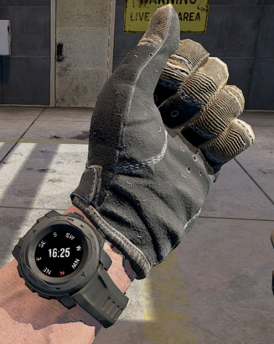
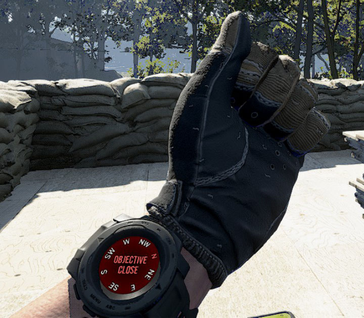

# GroundBranch

This repository is an app for Garmin Instinct 3 AMOLED Tactical to match
the layout of Ground Branch video games operator's watch.

## Features

- Compass display matching the Ground Branch game interface
- Proximity detection to configurable target coordinates
- Customizable settings for target location and alert radius

## Settings

Access the settings menu by pressing the menu button and selecting "Settings":

- **Target Latitude**: Set the target latitude (-90.0 to 90.0 degrees)
- **Target Longitude**: Set the target longitude (-180.0 to 180.0 degrees)  
- **Proximity Radius**: Set the alert radius in meters (1.0 to 1000.0 meters)

Settings are automatically saved and persist between app sessions.

## References in game

### Compass

### Objective detection

