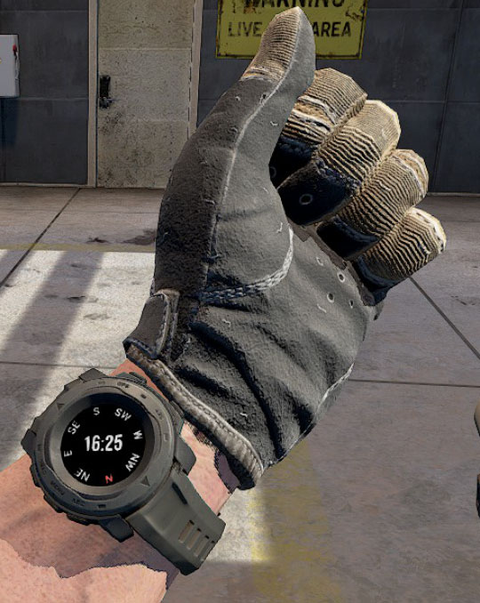
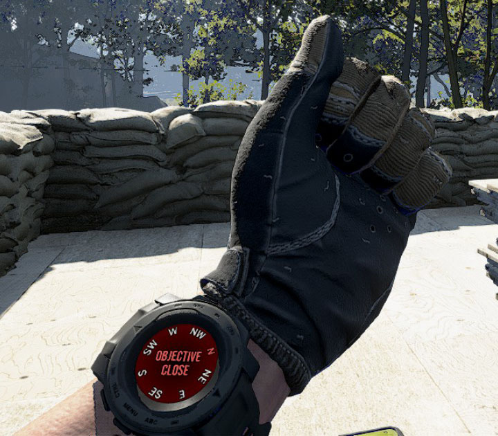

# Ground Branch Watch

This repository is an app for Garmin Instinct 3 AMOLED Tactical to match
the layout of Ground Branch video games operator's watch.

## Features

- **Compass Display**: Real-time compass with North indicator in red
- **Proximity Alert**: Vibration and visual alert when approaching target coordinates
- **Customizable Settings**: Configure target location and proximity radius

## User Settings

The app allows you to customize the following settings through Garmin Connect:

### Settings Configuration

1. **Target Latitude (°)**: The latitude of your target location
   - Range: -90° to +90°
   - Default: 48.8584 (Eiffel Tower, Paris)
   - Format: Decimal degrees (e.g., 34.0522 for Los Angeles)

2. **Target Longitude (°)**: The longitude of your target location
   - Range: -180° to +180°
   - Default: 2.2945 (Eiffel Tower, Paris)
   - Format: Decimal degrees (e.g., -118.2437 for Los Angeles)

3. **Proximity Radius (m)**: Distance in meters to trigger the proximity alert
   - Range: 3m to 100m
   - Default: 10m
   - The alert triggers when you're within this distance of the target

### How to Change Settings

1. Open the **Garmin Connect** app on your smartphone
2. Select your Instinct 3 device
3. Go to **Apps** or **Connect IQ Apps**
4. Find and select **Ground Branch**
5. Tap **Settings**
6. Adjust the values for:
   - Target Latitude
   - Target Longitude
   - Proximity Radius
7. Save your changes
8. Settings will sync to your watch automatically

### Viewing Current Settings

On the watch:
1. Press the **MENU** button while the app is running
2. Select **Settings Info** to view current coordinates and radius
3. The menu will display your configured location and proximity settings

### Input Validation

- Latitude values must be between -90 and +90 degrees
- Longitude values must be between -180 and +180 degrees
- Proximity radius must be between 3 and 100 meters
- Invalid values will be rejected by the Garmin Connect app

### Settings Persistence

- All settings are automatically saved and persist across:
  - App restarts
  - Watch reboots
  - Watch face changes
- Settings are loaded when the app starts and when you return to the app

## How It Works

### Proximity Alert

When GPS accuracy is ≤10m and your current location is within the configured proximity radius:
1. Watch vibrates (5-pulse pattern)
2. Red overlay appears with "OBJECTIVE CLOSE" message
3. Alert displays for 3 seconds
4. 15-second cooldown before next alert can trigger

### Compass

- Displays dual concentric rings
- Red ring shows North (N)
- White ring shows cardinal and intercardinal directions (NE, E, SE, S, SW, W, NW)
- Rotates in real-time based on device heading

## References in game

### Compass

### Objective detection

## Technical Details

- **Language**: Monkey C
- **SDK**: Garmin Connect IQ SDK
- **Target Device**: Garmin Instinct 3 AMOLED 50mm
- **Min API Level**: 5.0.0
- **Permissions**: GPS (Positioning), Sensors (Heading, Vibration)

## Development

This app uses the Garmin Connect IQ SDK and Monkey C programming language. Settings are managed through the Connect IQ properties system, which provides automatic validation, persistence, and synchronization.
